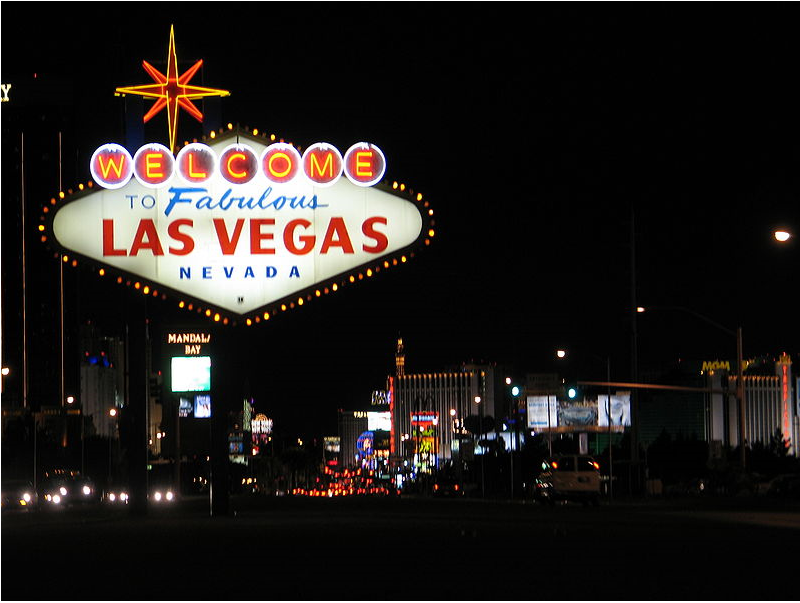

### __문제__
```markdown
Betty는 Gregory와 함께 만남으로써 그녀의 행적을 감추려고 한다. Round 2 패킷을 사용해서 다음의 질문에 답하시오.

그들은 어느 도시에서 만납니까?
```
---
### __파일 : round2.pcap__
<br>
Wireshark를 통해 패킷을 분석해본 결과 1024포트에서 진행된 패킷들의 크기가 큰 것으로 보아 의심스러워 [TCP or UDP Strem]을 이용해 패킷을 분석해보았다.<br>
그 결과 패킷 내용이 암호화 되어 있는 것을 발견했다.<br>
이를 확인하기 위해 NetworkMiner 프로그램을 이용한다.<br>

<br>

### __NetworkMiner 프로그램을 이용해 패킷 분석__
[Message]칸에서 주고 받은 메시지 내용을 확인할 수 있다.<br>
+ Message 1

```markdown
Hi Greg,

​
I am so sorry I no-showed. I wanted to make sure you didn't bring any friends :) We can try and meet up again though! Here is the password for where you should meet me: S3cr3tVV34p0n

Can't wait for you to get here!

Betty
```
위의 내용에서 만날 장소에 대한 비밀번호가 적혀 있음을 알 수 있다.

+ Message 2
```markdown
DCC SEND r3nd3zv0us 2887582002 1024 819200
```
DCC SEND 프로토콜을 애용해 819,200 byte 크기의 r3nd3zv0us파일이 1024포트를 통해 전송되었음을 알 수 있다.<br>
<Br>

### __Wireshark에서 r3nd3zv0us 파일 분석__
1024포트로 전송된 해당 크기의 패킷을 분석한 결과 헤더 시그니처도 없고 비밀번호만 존재함을 확인할 수 있다. <Br>
이는 TrueCrypt프로그램을 이용해 암호화된 파일임을 알 수 있다.<br>
해당 패킷을 파일로 저장하고 TrueCrypt 프로그램을 실행한다.
<br><br>

### __TrueCrypt 프로그램을 실행해 암호화 파일 분석__
패킷을 저장한 파일을 선택한 후 Message 1에서 나와있던 비밀번호를 입력하여 살펴보면 만날 장소가 나온 이미지 파일을 확인할 수 있다.<br><br>

### __만날 장소가 나온 이미지 파일__

<br>

## __정답 : LAS VEGAS__