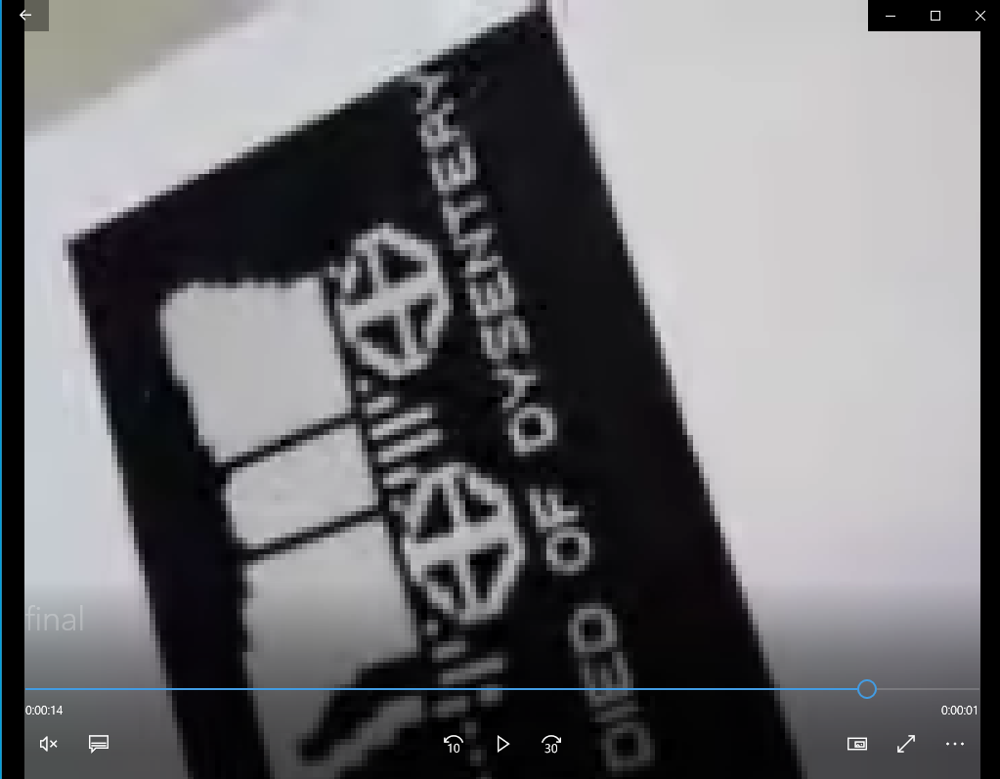

### __문제__
```markdown
Betty는 Gregory를 만나는 것을 주저한다. 사무실에서 늦게까지 일하는 동안 Gregory는 그의 전화벨을 들었다. 그는 전화를 확인하고 Betty와 만날 수밖에 없다는 것을 알게 됐다. Round 3 패킷을 사용해서 다음의 질문에 답하시오.

Gregory가 Betty를 만나지 못한다면 어떻게 죽게 되는가?
```
---
### __파일 : round3.pcap__
<br>
Wireshark 프로그램을 이용하여 해당 패킷으 분석한다.<br>
[Export Objects] -> [HTTP...]을 통해 HTTP로 주고 받은 패킷들을 살펴본 결과 390패킷이 mms로 전송되었음을 알 수 있다.<br>
<br>

### __TCP Stream을 이용해 390패킷을 분석한다.__
```
POST http://mmsc.cingular.com HTTP/1.1
x-att-deviceid: Huawei-U8665/HuaweiU8665B037
Accept: */*, application/vnd.wap.mms-message, application/vnd.wap.sic
x-wap-profile: http://wap1.huawei.com/uaprof/HuaweiU8665WCDMA-ATT.xml
Accept-Language: en-US
Content-Length: 140046
Content-Type: application/vnd.wap.mms-message
Host: mmsc.cingular.com
Connection: Keep-Alive
User-Agent: Huawei-U8665/HuaweiU8665B037

...T13fc9b6b93d.....Q..l.....14062076473/TYPE=PLMN....4065316942/TYPE=PLMN.......	:............<smil.xml>..application/smil..3...application/smil..smil.xml.."<smil.xml>..smil.xml.<smil><head><layout><root-layout width="320px" height="480px"/><region id="Image" left="0" top="0" width="320px" height="320px" fit="meet"/></layout></head><body><par dur="16101ms"><video src="VID_20130705_145557.mp4" region="Image" dur="16101ms"/></par></body></smil>Z..q.#video/mp4..VID_20130705_145557.mp4.."<VID_20130705_145557.mp4>..VID_20130705_145557.mp4.....ftypisom....isom3gp4....free......................
```
내용을 살펴보면 mp4파일이 스트림안에 숨겨있음을 알 수 있다.<br>
해당 패킷 내용을 raw형식으로 저장하여 HxD프로그램을 이용해 분석한다.<br><br>

### __HxD프로그램을 이용해 MP4파일을 추출한다.__
mp4파일 헤더 시그니처를 찾아서 이전의 불필요한 데이터는 지운 후 mp4파일 형식으로 저장한다.
+ tip. mp4파일 헤더 시그니처 =  00 00 00 18 66 74 79 70

<br>

### __정답이 담겨 있는 동영상 파일__
+ YOU HAVE DEAD OF DYSENTERY 라고 적혀있음을 확인할 수 있다.<br>
<br>

<br>
<br>

## __정답 : DYSENTERY__