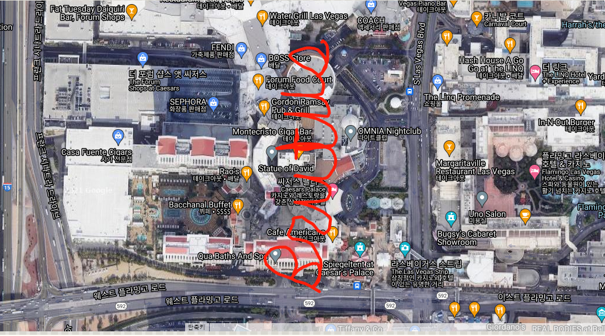

### __문제__
```markdown
Betty의 진정한 정체에 대해 여전히 확신이 없는 Gregory는 자신을 Betty의 동료라고 하는 한 단체와 만난다. 그들은 그에게 은행 계좌 번호와 추가 비밀 서류를 포함한 요구 사항 목록을 줬다. Betty의 동료는 Gregory에게 상품의 배달에 관한 정보를 제공 받을 것이라고 말했다. Round 4 패킷을 사용해서 다음의 질문에 답하시오.


Gregory에게 제공된 비밀번호는 무엇인가?
```
---
### __파일 : round4.pcap__
<br>
해당 파일을 NetworkMiner 프로그램을 이용하여 실행한 결과 Message가 있음을 알 수 있다.<br>
<br>

### __파일 속 [Message] 확인__
```
Hey Greg!

    I'm so happy you made it. :)  We should see a concert!  How about Rod Stewart, the hits.  Second Mezzanine, Section 4, Row H, Seat 410.You know the location and password for the drop.  We should get dinner afterwards!

Betty

<?xml version=\"1.0\" encoding=\"UTF-8\"?>

<kml xmlns=\"http://www.opengis.net/kml/2.2\">

<Document>
    <name>S3cr3t.kml</name>
```
- 메시지 내용을 통해 KML 형식의 코드가 담겨 있음을 알 수 있다.
- 하지만 코드는 중간에 끊겨 있었다.
- 따라서, Wireshark를 통해 해당 TCP Stream을 분석하였다.

<br>

### __Wireshark를 통해 메시지 내용 분석__
```
requests=%5B%7B%22From%22%3A%22betty_swindoll%40aol.com%22%2C%22To%22%3A%22d34thm3rch4nt%40aol.com%2C%22%2C%22Cc%22%3A%22%22%2C%22Bcc%22%3A%22%22%2C%22Subject%22%3A%22Dinner%20and%20a%20Show%22%2C%22RichBody%22%3A%22%3Cfont%20color%3D'black'%20size%3D'2'%20face%3D'arial'%3E%3Cfont%20color%3D%5C%22black%5C%22%20face%3D%5C%22arial%5C%22%20size%3D%5C%222%5C%22%3E%3Cfont%20face%3D%5C%22Arial%2C%20Helvetica%2C%20sans-serif%5C%22%3EHey%20Greg!%3Cbr%3E%5Cn%3Cbr%3E%5Cn%3C%2Ffont%3E%3C%2Ffont%3E%26nbsp%3B%26nbsp%3B%26nbsp%3B%20%3Cfont%20size%3D%5C%222%5C%22%3E%3Cfont%20face%3D%5C%22Arial%2C%20Helvetica%2C%20sans-serif%5C%22%3EI'm%20so%20happy%20you%20made%20it.%20%3A)%26nbsp%3B%20We%20should%20see%20a%20concert!%26nbsp%3B%20How%20about%20Rod%20Stewart%2C%20the%20hits
...
```
- 다음과 같이 코드에 해당되는 내용이 URL 인코딩 되어 있음을 발견하였다.
- URL 디코딩을 진행해 kml파일을 완성하였다.

<br><br>

### __KML Viewer를 통해 결과를 확인__


<br>

### __정답 : Brutus__
