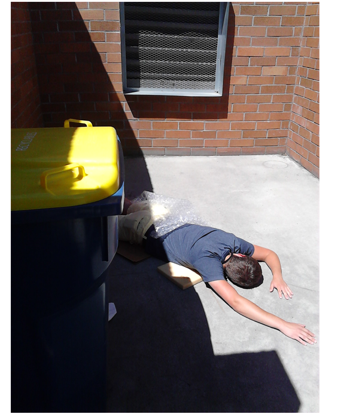

### __문제__
```markdown
Gregory가 실종됐다! 그는 Betty를 만나서 물건을 배달하기로 되어 있었다. 그 이후 행방이 묘연해졌다. 이상한 물품이 Rock Solid Investigations 사무실로 도착했다. Jack Stone은 패키지를 열고 노트와 휴대폰을 발견했다. Jack은 즉시 휴대 전화를 포렌식 전문가인 당신에게 보낸다. Gregory에게 상품의 배달에 관한 정보를 제공 받을 것이라고 말했다. Round5 zip을 사용해서 다음의 질문에 답하시오.


Gregory에게 무슨 일이 일어 난건가?
```
---
### __파일 : round5.zip__
<br>
해당 zip파일을 먼저 압축풀기를 진행한다.<br>
<br>

### __log파일 분석__
```markdown
UFED Log file
UFED version: 1.9.0.0 UFED
dump_android.cpp compiled on Mon May 27 09:33:02 2013
Connecting...
dump_android_fs.cpp compiled on Mon May 27 09:33:02 2013
Got root using "su"...
Vendor: HUAWEI
Version: 2.3.6
We've got root, continuing...
Sending "nandread" into "/proc/nandread"...
Unable to send file (FAIL    No such file or directory)
Sending "nandread" into "/data/local/tmp/nandread"...
Dumper client connection established...
Warning, globally excluding devices, pipes, symbolic links and sockets !
Warning, globally excluding "sys" !
Warning, globally excluding "dev" !
Warning, globally excluding "proc/*/*" !
Warning, globally excluding "proc/iomem" !
Warning, globally excluding "*/recovery/fota/*" !
Warning, globally excluding "data/hwvefs" !
Warning, globally excluding "*.apk" !
Warning, globally excluding "*.jar" !
Warning, globally excluding "*.dex" !
Warning, globally excluding "*.so" !
Warning, globally excluding "*.fbl" !
Warning, globally excluding "*.dem" !
Warning, globally excluding "*.gro" !
Warning, globally excluding "*.odex" !
Warning, globally excluding "data/gps/glgpsctrl" !
Warning, globally excluding "mnt/sdcard/Android/data/com.google.android.apps.books/files/volumes/*" !
Warning, globally excluding "data/data/com.lge.camera/files/*" !
Warning, globally excluding "data/local/tspreq" !
Warning, globally excluding "data/huawei_hwvefs/*" !
Warning, globally excluding ".cust_backup/CPM_ENCRYPTED_FOLDER/*" !
Recusively dumping root directory and below
Warning, unable to dump "acct/uid/10037/cpuacct.power" (FDFO - error 'Filesystem is potentially dangerous FS type: 27e0eb ')
Warning, unable to dump "acct/uid/10037/cpuacct.cpufreq" (FDFO - error 'Filesystem is potentially dangerous FS type: 27e0eb ')
...
```
+ log 파일을 통해 sdcard가 존재함을 알 수 있다.

<br>

### __Dump폴더 속 sdcard 분석__
sdcard 폴더 속에 DCIM폴더에 이미지 파일이 존재함을 알 수 있다.
<br><br>

### __이미지 파일__

+ 이미지를 보면 Gregory가 죽었음을 알 수 있다.

### __정답 : DIED__