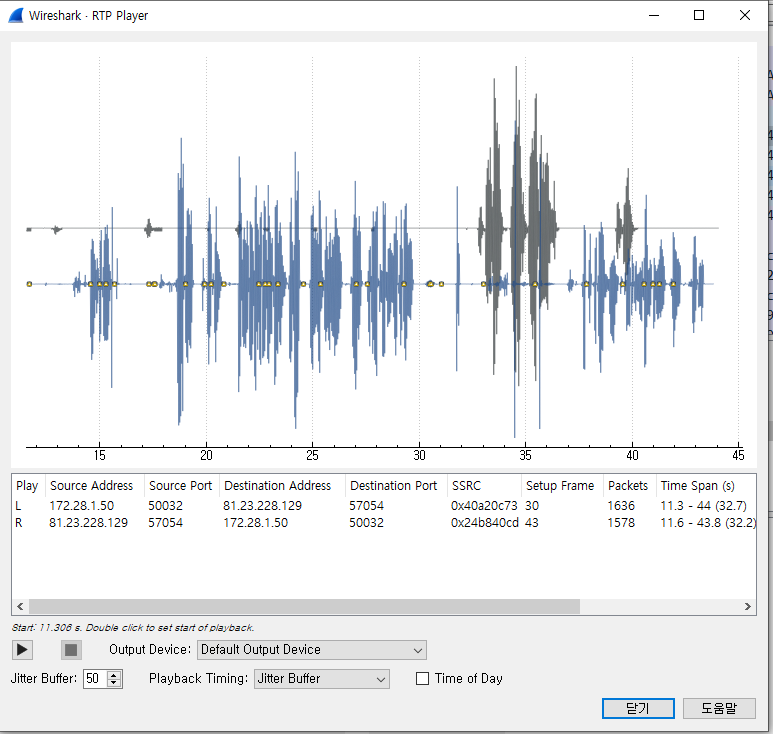

## __문제__
```
Jack이 사건을 마무리 짓고 있을 때, 그는 수수께끼가 아직 끝나지 않았다는 것을 알게 된다. Round 8 패킷을 사용해서 수수께끼에 대해 자세한 내용을 알아보고 다음 질문에 답하시오.

누가 Gregory를 죽였는가?
```
---

### __파일 : round8.pcap__
해당 파일을 wireshark를 통해 해당 파일을 분석한다.<br>
분석하는 도중 packet들 중 RTP를 이용한 packet이 존재함을 알 수 있다.<br>

### __RTP (Real-time Transport Protocol)__
+ 실시간 전송 프로토콜
+ IP 네트워크 상에서 오디오와 비디오를 전달하기 위한 통신 프로토콜

<br><br>

### __Wireshark에서 RTP 확인하는 방법
1. [Telephony] - [RTP] - [RTP Stream] : RTP packet들을 모두 볼 수 있고 각 packet별로 분석하여 음성을 들을 수 있다.
2. [Telephony] - [RTP] - [Stream Analyze] : 모든 packet들을 분석하여 주고 받은 모든 음성을 들을 수 있다.

<br><br>

### __RTP Stream을 분석하여 음성을 들은 결과__

+ Victoria와 Jack의 통화 내용이다.
+ Jack이 Gregory에 대해 얘기를 꺼내자 Victoria가 자신이 그를 죽였다고 말하는 것을 알 수 있다.

<br><br>

### __정답 : Victoria__