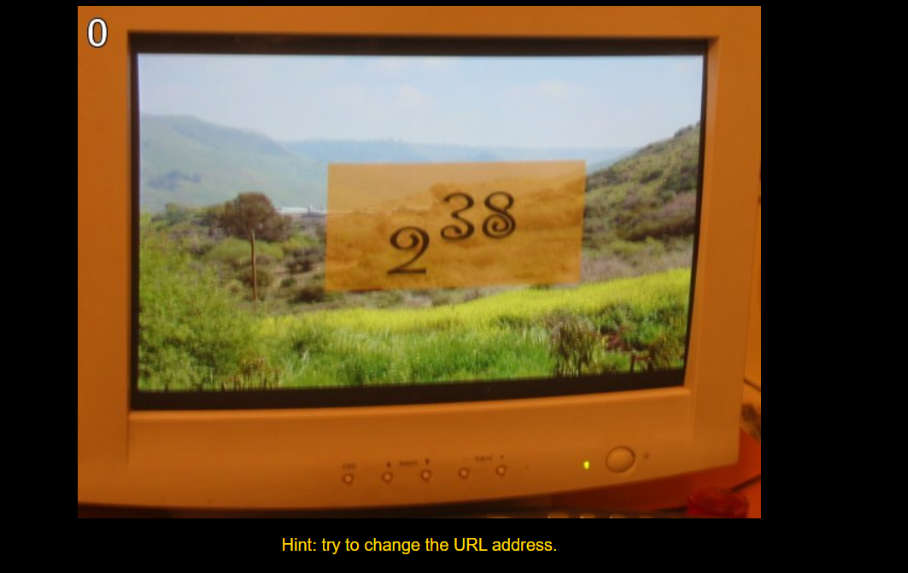

## __Python Challenge 0__
---
### __문제__
<br>



+ hint를 통해 URL주소를 변형해야 함을 알 수 있다.
+ 이미지의 숫자를 통해 2^38임을 예상하였다.

```python
>>> 2**38
274877906944
```

### __정답__
기존 주소 :  http://www.pythonchallenge.com/pc/def/0.html <br>
변형한 정답 주소 :  http://www.pythonchallenge.com/pc/def/274877906944.html 
