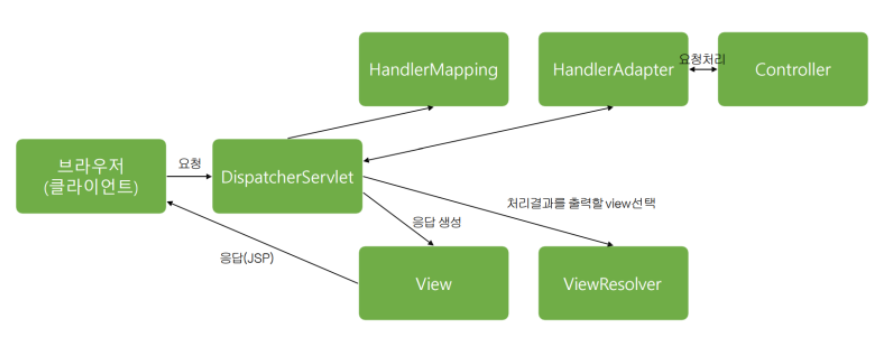

## Spring 기초
---
### 모델 1 아키텍처
- JSP에서 요청을 받고 처리하며 응답까지 진행하여 브라우저에 보여주는 아키텍처

 

### 모델 2 아키텍처
- Controller : 요청을 받고 필요한 요청을 처리하기 위해 호출을 담당한다. (전체적인 흐름 제어)
- Service : 요청 처리
- DAO : DB와 연동 작업 진행
- View : 요청 응답부분을 사용자에게 보여준다.

 

### 스프링 MVC
- 각 객체들이 독립적인 역할을 가지고 있고 깔끔하고 느슨하게 결합된 스프링 아키텍처 
[구조]

1) 브라우저는 특정 URL에 요청을 보낸다.
2) DispatcherServlet : 요청을 받고 파악하여 특정 핸들러 메서드를 호출한다.
3) DispatcherServlet은 HandlerMapping 객체에 Controller 객체 검색을 요청한다.
4) HanlerMapping에서는 Controller 객체를 검색하여 DispatcherServlet에 알려준다.
5) DispatcherServlet은 HandlerAdapter에 요청에 부합하는 메소드 검색을 요청한다.
6) HandlerAdapter는 메소드를 찾아서 Controller 객체에 보낸다.
7) Controller에서는 해당 메소드를 실행한 후 데이터를 HandlerAdapter에 보내고 DispatcherServlet에 알려준다.
8) DispatcherServlet은 처리 결과를 보여줄 View를 ViewResolver에서 선택한다.
9) DispatcherServlet은 응답 view를 View에 전달하여 브라우저로 응답 JSP를 보낸다 따라서 사용자에게 보여준다.

